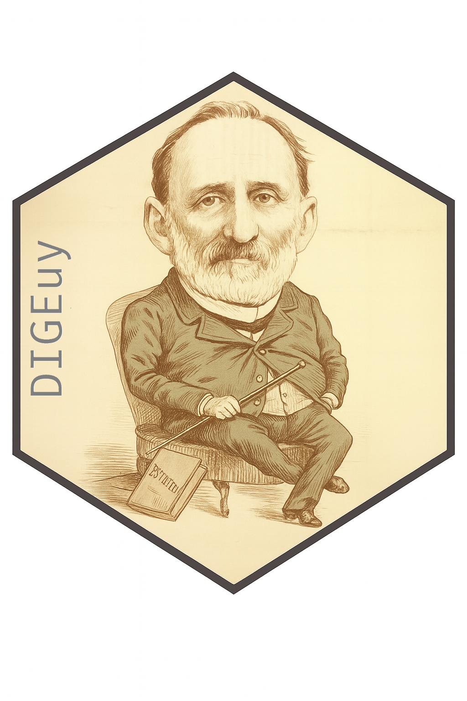

<!-- README.md is generated from README.Rmd. Please edit that file -->

```{r, include = FALSE}
knitr::opts_chunk$set(
  collapse = TRUE,
  comment = "#>",
  fig.path = "man/figures/README-",
  out.width = "100%"
)
```

## DIGE<b style='color:blue'>uy</b> 

> Directorio de Gremiales Empresariales de Uruguay desde 1871 a la actualidad. 

*Felipe Monestier, Nicolás Schmidt* 

<!-- badges: start -->
[](https://CRAN.R-project.org/package=DIGEuy)
[](https://github.com/Nicolas-Schmidt/DIGEuy/actions)
[](https://www.repostatus.org/#active)
`r badger::badge_devel("Nicolas-Schmidt/DIGEuy", "orange")`

<!-- badges: end --> 

### Descripción del paquete

Este paquete de R ofrece un conjunto de datos original que reúne la información de los directorios de las principales gremiales empresariales del Uruguay —incluyendo asociaciones rurales, industriales, comerciales y financieras— desde el último cuarto del siglo XIX hasta la actualidad. La base reúne y sistematiza registros dispersos en archivos públicos y privados, publicaciones periódicas y documentos institucionales, permitiendo por primera vez un análisis histórico de largo plazo sobre la composición y la evolución de las élites empresariales uruguayas, así como sus vínculos con el ámbito político.


### Descripción del Proyecto

> **Este proyecto fue financiado por CSIC en la modalidad I+D, llamado 2022 número 22520220100240UD, "Asociaciones empresariales y partidos políticos en el Uruguay (1900-2020)"**

El proyecto estuvo centrado en el estudio de los vínculos entre las organizaciones empresariales y los partidos políticos en Uruguay desde el comienzo del siglo XX hasta la actualidad.

El objetivo principal era construir una base de datos histórica que permitiera describir y explicar los cambios y permanencias en la participación de integrantes de las organizaciones empresariales en los partidos políticos a través del tiempo. El proyecto cumplió este objetivo al construir, en primer lugar, una base de datos histórica que incluye integrantes de las directivas de las principales organizaciones empresariales (rurales, industriales, comerciales y financieras) desde fines del siglo XIX a la actualidad.

Además, el proyecto permitió avanzar en la depuración de una base de datos histórica de la élite política uruguaya (incluyendo integrantes del poder ejecutivo y el poder legislativo a nivel nacional y departamental), así como agregar a esa base los/las integrantes de los directorios de los entes autónomos y empresas del estado desde sus orígenes hasta la actualidad ([**`puy`**](https://nicolas-schmidt.github.io/puy/))..

Aunque no estaba previsto inicialmente, el proyecto permitió construir tres bases de datos complementarias: una base de datos histórica de integrantes de las comisiones del poder legislativo, una base de datos de integrantes de los directorios del Partido Nacional y una base de datos de socios/os del Jockey Club del Uruguay desde 1910 a 1960.


### Bases de datos

**`digeuy`**: Esta base de datos contiene información detallada sobre los integrantes de las directivas de organizaciones gremiales empresariales en Uruguay, incluyendo nombre de la organización, sigla, período de actividad de cada directiva y duración en años. Permite analizar la composición, continuidad y cambios en las directivas a lo largo del tiempo, así como estudiar redes de participación dentro del sector empresarial.


| Organización                                      | Sigla | Desde | Hasta | Años |
|---------------------------------------------------|-------|-------|-------|------------------|
| Asociación Rural del Uruguay                      | ARU   | 1871  | 2023  | 152              |
| Federación Rural                                   | FR    | 1915  | 2021  | 106              |
| Unión Industrial Uruguaya                          | UIU   | 1914  | 1946  | 32               |
| Asociación de Bancos Privados del Uruguay          | ABPU  | 2005  | 2024  | 19               |
| Asociación de Bancos de Uruguay                    | ABU   | 1976  | 2002  | 26               |
| Asociación de Consignatarios de Ganado              | ACG   | 1920  | 2024  | 104              |
| Cámara Mercantil                                    | CM    | 1908  | 2021  | 113              |
| Cámara de Comercio                                  | CC    | 1897  | 2022  | 125              |
| Cámara de Industrias del Uruguay                    | CIU   | 1899  | 2018  | 119              |
| Confederación de Cámaras Empresariales              | CCE   | 2016  | 2024  | 8                |
| Asociación Nacional de Broadcasters Uruguayos       | ANBU  | 1933  | 2025  | 92               |


##### Las siguientes bases de datos van a estar alojadas en el paquete de R [**`puy`**](https://nicolas-schmidt.github.io/puy/)(Schmidt et al., 2024)

**`entes`**: Esta base de datos contiene información sobre los integrantes de los directorios de entes y servicios descentralizados en Uruguay, incluyendo nombre de la organización, sigla, período de actividad de cada directorio y duración en años. Permite analizar la composición, continuidad y cambios en los directorios a lo largo del tiempo, facilitando estudios sobre la gestión y gobernanza de los distintos organismos públicos y servicios descentralizados.

| Organización                                                              | Sigla  | Desde | Hasta | Años |
|----------------------------------------------------------------------------|--------|-------|-------|------------------|
| Administración Nacional de Combustibles, Alcohol y Portland               | ANCAP  | 1931  | 2023  | 92               |
| Administración Nacional de Correos                                        | ANC    | 1995  | 2023  | 28               |
| Administración Nacional de Puertos                                        | ANP    | 1916  | 2023  | 107              |
| Administración Nacional de Telecomunicaciones                             | ANTEL  | 1974  | 2023  | 49               |
| Administración Nacional de Usinas y Transmisiones Eléctricas              | UTE    | 1912  | 2020  | 108              |
| Administración de los Servicios de Salud del Estado                       | ASSE   | 2007  | 2021  | 14               |
| Banco Central del Uruguay                                                  | BCU    | 1967  | 2021  | 54               |
| Banco Hipotecario del Uruguay                                              | BHU    | 1892  | 2023  | 131              |
| Banco de Previsión Social                                                  | BPS    | 1967  | 2023  | 56               |
| Banco de Seguros del Estado                                                | BSE    | 1911  | 2020  | 109              |
| Banco de la República Oriental del Uruguay                                 | BROU   | 1896  | 2021  | 125              |
| Junta de Transparencia y Ética Pública                                     | JUTEP  | 1999  | 2023  | 24               |
| Obras Sanitarias del Estado                                                | OSE    | 1953  | 2023  | 70               |
| Unidad Reguladora de Servicios de Comunicaciones                          | URSEC  | 2001  | 2023  | 22               |
| Unidad Reguladora de Servicios de Energía y Agua                          | URSEA  | 2000  | 2020  | 20               |


| Organización                                           | Sigla | Desde | Hasta | Años |
|--------------------------------------------------------|-------|-------|-------|------------------|
| Comisiones legislativas de Senadores y Diputados       |       | 1911  | 1958  | 47               |
| Directorios del Partido Nacional                       |       | 1887  | 1985  | 98               |
| Directorios del Partido Nacional Independiente         |       | 1933  | 1959  | 26               |
| Jockey Club                                             |       | 1910  | 1960  | 50               |


